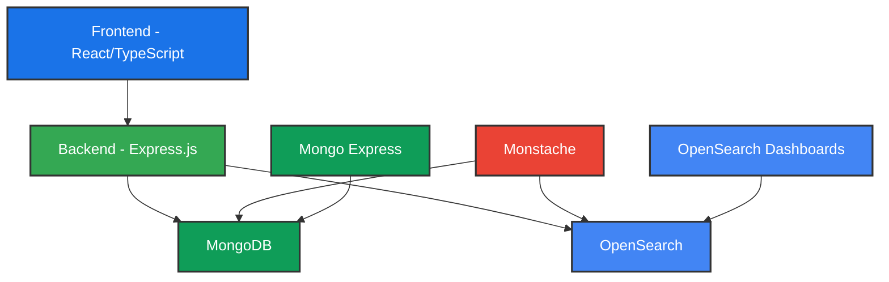

# OpenSearch News Search Application

A modern news search application that combines MongoDB for data storage with OpenSearch for advanced search capabilities, featuring hybrid search (keyword + neural) and semantic search capabilities.

## 🏗️ Architecture

The application follows a microservices architecture with the following components:



### Components

- **Frontend**: React/TypeScript application with Vite
- **Backend**: Express.js server providing REST API
- **MongoDB**: Primary data store for news posts
- **OpenSearch**: Search engine with hybrid search capabilities
- **Monstache**: MongoDB to OpenSearch sync tool
- **OpenSearch Dashboards**: Web interface for OpenSearch
- **Mongo Express**: Web-based MongoDB admin interface

## 🚀 Features

- Full-text search with hybrid capabilities:
  - Keyword-based search with fuzzy matching
  - Neural search using sentence transformers
  - Cross-encoder based reranking
- Real-time data synchronization between MongoDB and OpenSearch
- RESTful API for CRUD operations
- Modern, responsive frontend interface
- Health monitoring and status checks

## 🛠️ Prerequisites

- Docker and Docker Compose
- Node.js 16+ (for local development)
- npm or yarn

## 🏁 Getting Started

1. Clone the repository:
   ```bash
   git clone <repository-url>
   cd OpenSearch
   ```

2. Start the services using Docker Compose:
   ```bash
   docker-compose up -d
   ```

3. Access the services:
   - Frontend: http://localhost:3000
   - Backend API: http://localhost:4000
   - OpenSearch Dashboards: http://localhost:5601
   - Mongo Express: http://localhost:8081

You can recreate everything using `make recreate`.
If you just want to restart the services (also building the backend again), use `make restart`.

## 🔍 Debugging

### Analyzing search relevancy

Go to http://localhost:5601/app/searchRelevance and enter the following query:

```
{
  "query": {
    "hybrid": {
      "queries": [
        {
          "multi_match": {
            "query": "%SearchText%",
            "fields": ["title^4", "description"],
            "type": "best_fields",
            "fuzziness": "AUTO"
          }
        },
        {
          "neural": {
            "title_vector": {
              "query_text": "%SearchText%",
              "model_id": "FksZeZcBjYUBdzG2UgCi",
              "k": 5
            }
          }
        },
        {
          "neural": {
            "description_vector": {
              "query_text": "%SearchText%",
              "model_id": "FksZeZcBjYUBdzG2UgCi",
              "k": 5
            }
          }
        }
      ]
    }
  },
  "ext": {
    "rerank": {
      "query_context": {
        "query_text": "%SearchText%"
      }
    }
  }
}
```

Then enter your search query and play around with it.

## 🔧 Configuration

### Environment Variables

#### Backend
- `MONGODB_URI`: MongoDB connection string
- `PORT`: Backend server port (default: 4000)

#### MongoDB
- `MONGO_INITDB_ROOT_USERNAME`: Admin username
- `MONGO_INITDB_ROOT_PASSWORD`: Admin password
- `MONGO_INITDB_DATABASE`: Database name

#### OpenSearch
- Memory settings can be adjusted in docker-compose.yml
- Security settings can be configured as needed

## 📚 API Documentation

### News Posts API

- `GET /api/news`: Get all news posts
- `GET /api/news/:id`: Get a specific news post
- `POST /api/news`: Create a new news post
- `PUT /api/news/:id`: Update a news post
- `POST /api/news/search`: Search news posts

### Health Check

- `GET /health`: Check service health status

## 🔍 Search Features

The application implements a hybrid search approach combining:

1. Keyword Search
   - Fuzzy matching
   - Field boosting (title^4, description)
   - Best fields matching

2. Neural Search
   - Sentence transformer-based semantic search
   - Separate vectors for title and description
   - Configurable k-nearest neighbors

3. Reranking
   - Cross-encoder based reranking
   - Query-aware scoring

## 🤝 Contributing

1. Fork the repository
2. Create your feature branch (`git checkout -b feature/amazing-feature`)
3. Commit your changes (`git commit -m 'Add some amazing feature'`)
4. Push to the branch (`git push origin feature/amazing-feature`)
5. Open a Pull Request

## 📝 License

This project is licensed under the MIT License - see the LICENSE file for details.

## 🙏 Acknowledgments

- OpenSearch for the powerful search capabilities
- MongoDB for the robust document database
- Monstache for the seamless MongoDB-OpenSearch synchronization
